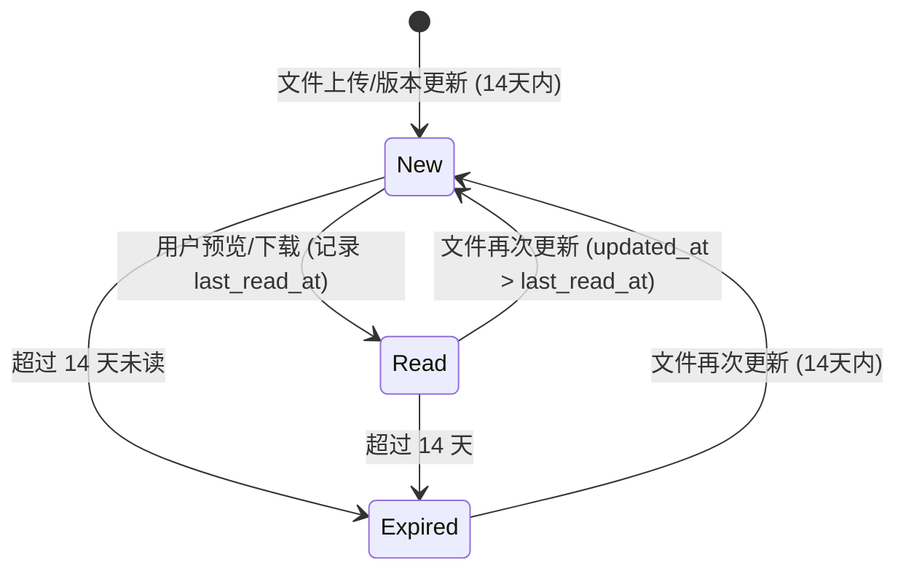

# 07 文件状态机逻辑 (File Status StateMachine Logic)

> **核心目标**：通过精准的状态流转判定，确保用户能及时感知资产的新增与更新，同时避免陈旧信息的干扰。

## 1. 状态定义
系统中的资产文件主要存在以下三种逻辑状态：

1.  **New (新增/更新)**：资产对当前用户处于“未读”或“有新版本”状态，且在 14 天有效期内。
2.  **Read (已读)**：用户已消费该资产（预览或下载），且资产未发生后续更新。
3.  **Expired (陈旧)**：资产更新时间已超过 14 天，不再主动提醒。

## 2. 状态流转图 (Mermaid)



## 3. 核心判定逻辑 (New 标判定)

系统通过 `AssetFileController.isNewFile()` 方法实现状态判定，逻辑如下：

### 3.1 准入条件 (14 天金线)
*   **逻辑**：只有在最近 14 天内发生过变动的文件才具备显示 "New" 标的资格。
*   **代码实现**：`file.updated_at > now() - 14 days`。

### 3.2 消除逻辑 (阅读状态感知)
*   **逻辑**：在准入条件下，若用户未读过该文件，或文件更新时间晚于用户的最后阅读时间，则显示 "New" 标。
*   **数据支撑**：查询 `user_file_state` 表。
*   **判定公式**：
    ```java
    if (userFileState == null || file.updatedAt > userFileState.lastReadAt) {
        return true; // 显示 New 标
    }
    ```

## 4. 状态触发机制

### 4.1 触发 "New" 状态
*   **场景 A (新增)**：新文件入库，`updated_at` 设为当前时间。
*   **场景 B (更新)**：上传同名文件覆盖旧版本，`updated_at` 更新为当前时间。

### 4.2 触发 "Read" 状态
*   **场景 A (预览)**：用户点击“预览”按钮，调用 `/api/asset/{id}/view` 接口。
*   **场景 B (下载)**：用户点击“下载”按钮，调用 `/api/asset/download` 接口。
*   **后端动作**：异步调用 `recordReadState` 方法，更新 `user_file_state.last_read_at`。

## 5. 性能优化
*   **批量判定**：在获取资产列表（如 `getTree` 或 `getLatestUpdates`）时，系统会批量查询当前用户的阅读状态，避免 N+1 查询问题。
*   **索引支持**：在 `asset_file.updated_at` 和 `user_file_state.(user_id, file_id)` 上建立索引，确保状态判定在毫秒级完成。
